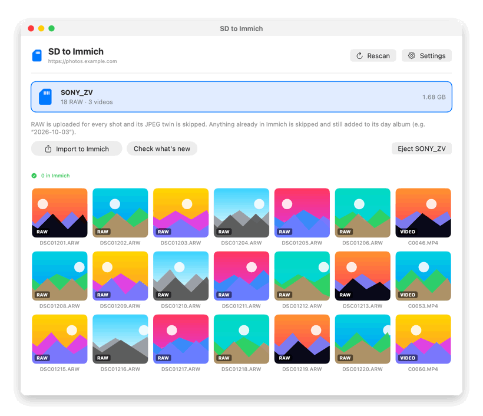
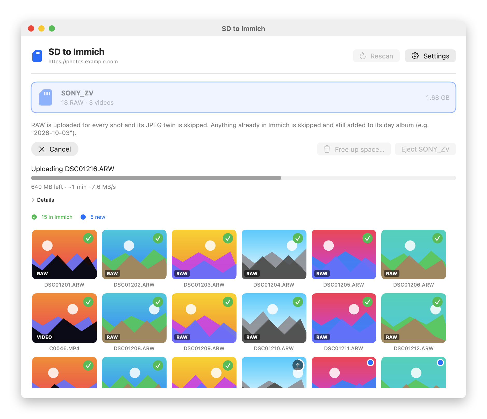
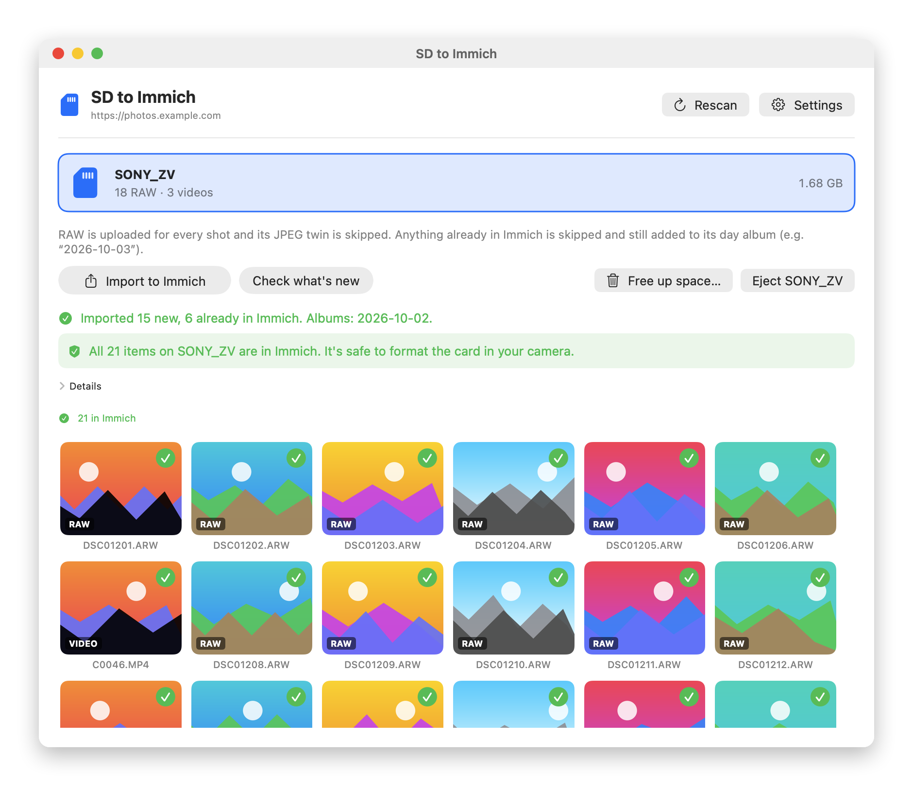
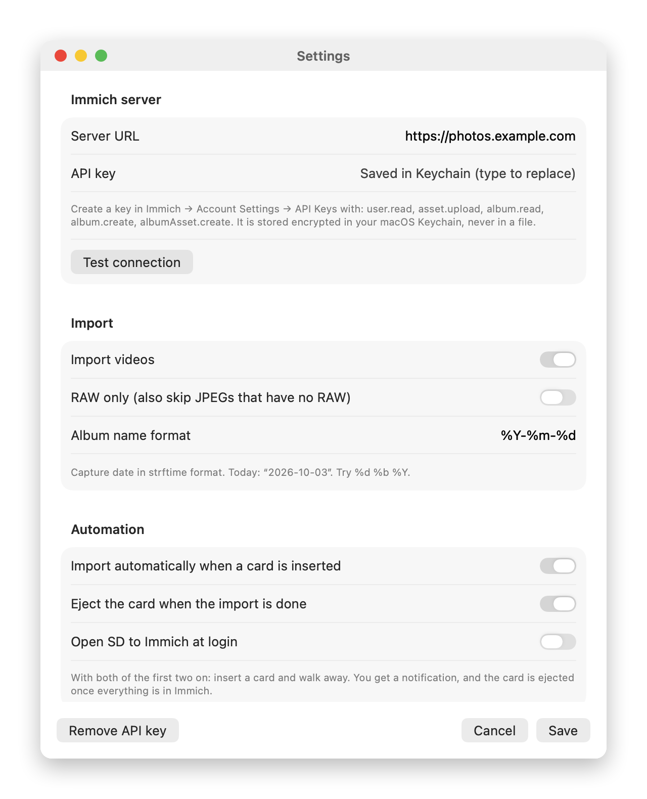

# SD to Immich: import camera SD cards into Immich on Mac

**SD to Immich** is a free, open-source macOS app that imports photos and videos from a camera SD card into your self-hosted [Immich](https://immich.app) photo server. It uploads **RAW files first**, **never uploads duplicates**, and sorts everything into **albums by date**.

Insert the card, click **Import to Immich**, done. Or turn on auto-import and just insert the card: it imports, tells you when the card is safe to format, and ejects it.

<p align="center">
  
</p>

[](#download)
[](https://immich.app)
[](#build-from-source)
[](LICENSE)

**Contents:** [Features](#features) · [Screenshots](#screenshots) · [Download](#download) · [Setup](#setup) · [Supported cameras](#supported-cameras) · [How cards are detected](#how-cards-are-detected) · [Multiple cards](#multiple-sd-cards-and-dual-slot-cameras) · [How it works](#how-it-works) · [Settings](#settings) · [FAQ](#faq)

---

## Features

- **RAW + JPEG done right.** Shoot RAW+JPEG and only the RAW (ARW, CR3, NEF, RAF, DNG, …) is uploaded. A JPEG is uploaded only when a shot has no RAW, and never once its RAW has been imported, even from a later card.
- **No duplicates.** Every file is checked against your Immich library by checksum, so re-inserting a card or importing an overlapping card uploads only what is new.
- **Albums by date.** Photos and videos go into albums named after the day they were taken (`2026-10-02`, or any format you like, e.g. `02 Oct 2026`). Existing albums are reused.
- **Photos and videos.** Video clips are imported too, including Sony's separate video folder.
- **See every file.** Thumbnails of every photo and video on the card (RAW previews included), each with a status mark: ✓ in Immich, uploading, new, or skipped.
- **Hands-free.** Optionally import automatically when a card is inserted, eject it when done, and open at login.
- **Safe to format?** After an import the app tells you whether every photo and video on the card is confirmed in Immich, or what is missing. Photos that only exist in Immich's trash don't count as backed up.
- **Free up space.** One button deletes from the card exactly what is confirmed in Immich (re-checked right before deleting), plus the JPEG twins of those RAWs and the camera's sidecar files. Everything else stays.
- **Fast, with an ETA.** Works in batches of 20, so uploads start within seconds, and shows time left and speed. Checksums are cached: re-checking a card takes about a second.
- **Native Mac app, nothing else to install.** Written in Swift. Detects a card the moment you insert it, shows live progress, notifies you when done, and ejects the card.
- **Big videos that actually upload.** Optional SSH relay for multi-GB clips on slow connections (see [FAQ](#faq)).
- **Private and safe.** Talks only to your Immich server. The API key is kept in the macOS Keychain. Files on the card are only read, never changed or deleted.

## Screenshots

| Importing | Done | Settings |
|---|---|---|
|  |  |  |

<sub>Demo content: the photos are generated placeholders and the server is fictional.</sub>

## Download

1. Download `SD-to-Immich-x.y.z.zip` from the [latest release](../../releases/latest) and unzip it.
2. Move **SD to Immich.app** to your Applications folder.
3. The app is open source but not notarized by Apple, so macOS blocks the first launch. Open it once, then go to **System Settings → Privacy & Security** and click **Open Anyway**. (Or run `xattr -dr com.apple.quarantine "/Applications/SD to Immich.app"`.)

Requirements: macOS 13 Ventura or newer, Apple Silicon or Intel, and an Immich server (tested with Immich v3.2).

## Setup

1. In Immich, open **Account Settings → API Keys → New API Key** and grant:
   `user.read`, `asset.upload`, `album.read`, `album.create`, `albumAsset.create`.
2. Open **SD to Immich → Settings**, enter your Immich address (e.g. `https://photos.example.com`) and paste the key.
3. Click **Test connection**, then **Save**.

Insert a camera card. It appears in the window with its thumbnails. Click **Check what's new** for a dry run, or **Import to Immich**. The first time, allow macOS to let the app read the card.

## Supported cameras

Any camera that saves to a standard `DCIM` folder, which is practically every digital camera.

| Brand | RAW formats | Videos |
|---|---|---|
| Sony (Alpha, ZV-E10, ZV-1, FX30, A7 series) | ARW, SR2 | MP4 in `PRIVATE/M4ROOT/CLIP`, AVCHD |
| Canon (EOS R, EOS, PowerShot) | CR3, CR2 | MP4, MOV |
| Nikon (Z, D series) | NEF, NRW | MP4, MOV |
| Fujifilm (X, GFX series) | RAF | MOV, MP4 (HEIF `.HIF` photos too) |
| Panasonic Lumix, OM System / Olympus | RW2, ORF | MP4, MOV, AVCHD |
| Pentax, Leica, Ricoh, DJI drones | DNG, PEF | MP4, MOV |
| GoPro and action cameras | n/a | MP4 (low-res `.LRV` / `.THM` proxies are ignored) |

Tested with a Sony ZV-E10 II. RAW and JPEG are paired by file name (`DSC01234.ARW` + `DSC01234.JPG`), which is how all of these cameras name them. Cinema formats such as Canon `.CRM` and `.MXF` are not imported.

## How cards are detected

The app looks at **what is on a volume**, not at the hardware:

- Every mounted volume in `/Volumes` with a **`DCIM` folder** at the top is treated as a camera card. `DCIM` is the folder every camera creates (DCF standard).
- Anything without `DCIM` (external drives, pen drives with normal files, network shares) is ignored. Your Mac's internal disk is never touched.

So a card works in the Mac's SD slot, in any USB card reader, or with the camera plugged in by USB in mass-storage mode. A drive onto which you copied a whole card (with its `DCIM` folder) is also picked up, which is handy for importing old backups.

## Multiple SD cards and dual-slot cameras

- Every inserted card is listed; select one and import it, then the next. Files that are on more than one card are uploaded once.
- **Dual-slot cameras** writing RAW to one card and JPEG to the other: **import the RAW card first.** The app remembers those shots, so the JPEGs on the second card are skipped automatically.

## How it works

| Step | What happens |
|---|---|
| Find cards | Volumes with a `DCIM` folder (see above). |
| Pick files | Group files by shot. Keep the RAW; keep the JPEG only if there is no RAW. Add videos. |
| Check | In batches of 20: checksum each file (SHA-1, cached) and ask Immich (`/assets/bulk-upload-check`) which ones it already has. |
| Upload | Upload only the new files, with their capture date from EXIF. |
| Albums | Add each batch to its date albums, creating them if needed. A cancelled import keeps everything finished so far. |

Imported RAW shots are remembered in `~/Library/Application Support/sd2immich/raw-shots.json`, so their JPEG twins stay skipped on later imports. Each card scan is logged to `~/Library/Logs/SD to Immich.log`.

## Settings

| Setting | Default | Meaning |
|---|---|---|
| Server URL | | Your Immich address, without `/api` |
| API key | | Stored in the login Keychain (service `sd-card-to-immich`) |
| Import videos | on | Include video clips |
| RAW only | off | Also skip JPEGs that have no RAW |
| Album name format | `%Y-%m-%d` | strftime format of the capture date, e.g. `%d %b %Y` |
| Import automatically | off | Start importing as soon as a card is inserted |
| Eject when done | off | Eject the card after a successful import |
| Open at login | off | Start SD to Immich when you log in (macOS Login Items) |
| Relay SSH host | empty | Optional `user@host` near Immich for big files |
| Relay threshold | 300 MB | Files above this go through the relay |

Settings other than the key are stored in `~/.config/sd2immich/config.json` (readable only by you). See [`config.example.json`](config.example.json).

## FAQ

**How do I upload photos from an SD card to Immich on a Mac?**
Install SD to Immich, add your server URL and an API key in Settings, insert the card and click **Import to Immich**. No command line needed.

**Does it delete or change anything on the SD card?**
Importing only reads the card. Files are deleted only when you click **Free up space** and confirm. When an import finishes the app tells you whether the card is safe to format; you can then format it in your camera, or use Free up space.

**What exactly does "Free up space" delete?**
Right before deleting, the app checks every photo and video on the card against Immich by checksum. It deletes only the ones Immich has (and not just in its trash), plus files that belong to them: the JPEG twin of each confirmed RAW (also when that RAW was imported from an earlier card), and the sidecar XML and thumbnail of Sony clips (GoPro: LRV/THM). Files that aren't in Immich, folders and the camera's database files stay. It asks for confirmation with the number of files and the space it frees.

**Why does it say a photo is "in Immich's trash"?**
The card has a photo whose exact copy was deleted in Immich and is waiting in Immich's trash, which is emptied after 30 days. The app doesn't count it as backed up: restore it in Immich (Trash → Restore) if you want to keep it, then check again.

**Why is the JPEG skipped when I shoot RAW+JPEG?**
Immich shows RAW files with previews, so keeping both would double your library with near-identical images. Turn on "RAW only" to skip JPEG-only shots as well.

**What if I import the same card twice?**
Nothing is uploaded twice. Items already in Immich are skipped and just added to their album if missing.

**My SD card doesn't show up.**
Allow the app to read removable volumes: accept the macOS prompt, or enable it in **System Settings → Privacy & Security → Files and Folders → SD to Immich → Removable Volumes**, then click **Rescan**. The card also needs a `DCIM` folder. `~/Library/Logs/SD to Immich.log` shows which volumes were seen and why.

**Big videos fail with "broken pipe" or stop after ~5 minutes.**
Immich drops uploads that take longer than about 5 minutes, which happens with multi-GB clips over a slow link (VPN, Wi-Fi, Tailscale relay). Use a faster connection, or set a **relay SSH host** in Settings: files over the threshold are copied there with `rsync` (resumable) and uploaded from next to the server.

**Why does macOS ask to let SD to Immich use the Keychain?**
The API key is stored encrypted in your Keychain. The app isn't signed with an Apple developer ID, so macOS asks once after each install or update whether the new version may read it. The app explains this first; click **Always Allow**.

**Is this an official Immich app?**
No. It is an independent open-source project that uses Immich's public API. An alternative to the Immich CLI and to uploading through the web page, built for camera cards.

## Build from source

```sh
git clone https://github.com/dig22/sd-card-to-immich.git
cd sd-card-to-immich
./build.sh 2.2.0      # needs Xcode or the Command Line Tools
open "build/SD to Immich.app"
```

Run the tests with `Tests/run.sh` (unit tests on a generated fake camera card). Add `IMMICH_URL`, `IMMICH_API_KEY` and optionally `IMMICH_DUPLICATE_FILE` (a photo already in Immich) to also run integration checks against a real server; nothing is stored.

`tools/make-screenshots.sh` regenerates the screenshots and GIF in `docs/` from the app's real views with demo data.

## License

[MIT](LICENSE)
